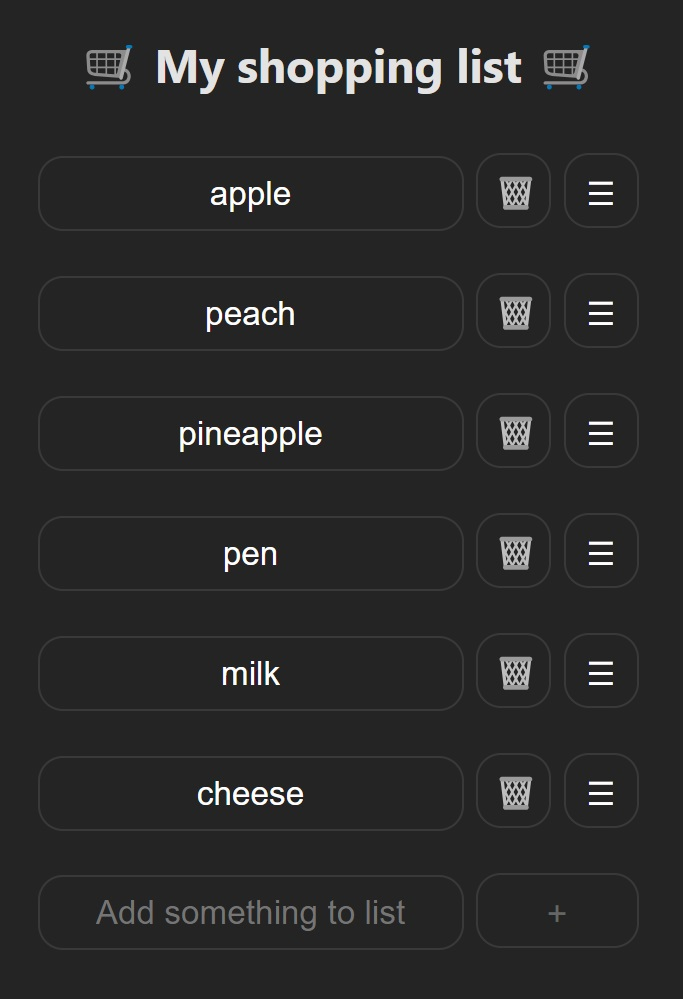

# Shopping App

Welcome! I make a **React.js + Vite** app for manage shopping list in 

## Features

- **Adding Items**
- **Removing Items**

## Getting Started

To get started with the Shopping App, follow these steps:

1. Clone this repository to your local machine:

    ```bash
    git clone https://github.com/Igor5667/shoppingListReact.git
    ```

2. Navigate to the project directory:

    ```bash
    cd shopping-app
    ```

3. Install dependencies:

    ```bash
    npm install
    ```

4. Run the development server:

    ```bash
    npm run dev
    ```

5. Ctrl+click provided link to view the app.

## Current view

